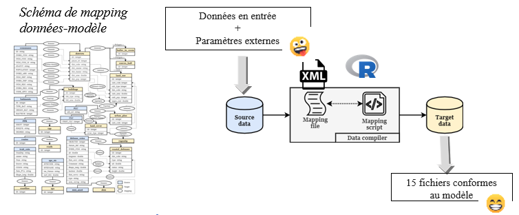

class: center
title: "Présentation SIGR 2021"

# Présentation
<!--  -->


#### Cécilia Pignon-Mussaud

.pull-left[
*   IE Géomatique – [LIENSs](https://www.lienss.univ-lr.fr/) (LIttoral ENvironnement et Sociétés) – La Rochelle
*   Unité mixte de recherche interdisciplinaire (La Rochelle Université – CNRS) : biologie, biochimie, géophysique, géographie, histoire…
*   Assistance technique, appui à la recherche
]

 

```{r, echo=FALSE, out.width="90%"}

```


.footnote[_Ecole thématique SIGR 2021_]

---
# Champs de recherche
** Caractérisation et adaptation du littoral au changement climatique : **

- [Études sur la dynamique côtière](#3): évolution du trait de côte, 
morphologie (profils topographiques), morphométrie …

- [Impacts / adaptations aux risques naturels](#3) : érosion/submersion marine

- [Suivi de populations](#3) : exemple : migration oiseaux, zone de reposoir/reproduction


.footnote[_Ecole thématique SIGR 2021_]


---

# Outils
- [SIG](#3) : ArcMap / ArcGisPro (ModelBuilder, ArcPy), QGIS (Modeleur graphique)

- [ETL](#3) : FME, Talend Open Studio

- [BD](#3): PostgreSQL/PostGIS

- [Serveurs cartographiques](#3) : ArcgisServer-> Mapserver

- [Metadata](#3) : GeoNetwork via API Sextant (Ifremer)

…un peu de Python et de R…


-> multiple outils, disciplines,  projets, thématiques ... 

[ "video")

```{r, echo=FALSE, out.width="30%"}
knitr::include_app ("https://img1.picmix.com/output/stamp/thumb/0/4/7/8/1158740_b7d0b.gif")
``` 

.footnote[_Ecole thématique SIGR 2021_]

---

# Problématiques de reproductibilité 

.pull-left[
**Études sur la dynamique côtière** : évolution du trait de côte, 
morphologie (profils topographiques), morphométrie 

- #### Caractérisation des îles 
indicateur de robustesse morphologique

 
]
.pull-right[
- #### Caractérisation des pentes externes : 
rupture de pente, plateau récifal, zone de production sédimentaire…-> typologie

 
]


.footnote[_Ecole thématique SIGR 2021_]

---

- #### Évolution diachronique : Suivis annuels et saisonniers
Du trait de côte, des formes, des volumes, du couvert végétal…. 
Ex : comparer des MNS issus des traitements photogrammétriques de la PF Drone (calcul de volumes, détecter des formes…)

 


.footnote[_Ecole thématique SIGR 2021_]

---
**Consolider les données / Contrôle qualité?**  
- #### Automatiser les traitements de données en entrée d'un SMA

Projet LittoSIM : dispositif de simulation participative et de mise en situation pour la sensbilisation aux risques de submersion marine** : 

Décrire précisément la relation données-modèle 
Data Mapping : la liaison entre la source et les données cibles

 

.footnote[_Ecole thématique SIGR 2021_]

---

**Automatiser les résultats d’un dispositif de simulation participative et de mise en situation pour la sensibilisation aux risques de submersion marine (LittoSIM)**  

Comparer les phases de jeu, les communes, les archétypes, les ateliers…l'apprentissage des joueurs

 

.footnote[_Ecole thématique SIGR 2021_]

---


**Aide à la saisie des métadonnées** 


Script R packages Geoflow, Geometa

Documentation pour saisir au mieux les informations.


- Programmer le lancement du script R lorsque le fichier .csv a été mis à jour.

- Importer automatiquement dans Geonetwork les nouveaux .xml générés

- Basculer le script Python vers R pour la génération des illustration ?

- Gérer les flux dans Geoserver ??


.footnote[_Ecole thématique SIGR 2021_]


---
class: center, middle

# Merci à Olivier et Jakub pour leur aide!
<br/>&#x1F60E;   
Slides created via the R packages:

[**xaringan**](https://github.com/yihui/xaringan)<br>
[gadenbuie/xaringanthemer](https://github.com/gadenbuie/xaringanthemer)

The chakra comes from [remark.js](https://remarkjs.com), [**knitr**](http://yihui.name/knitr), and [R Markdown](https://rmarkdown.rstudio.com).
